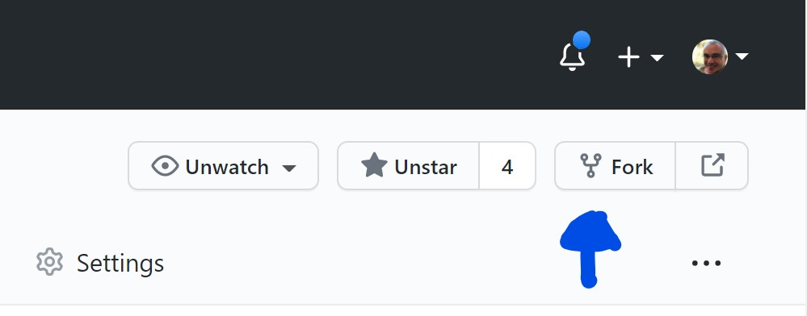
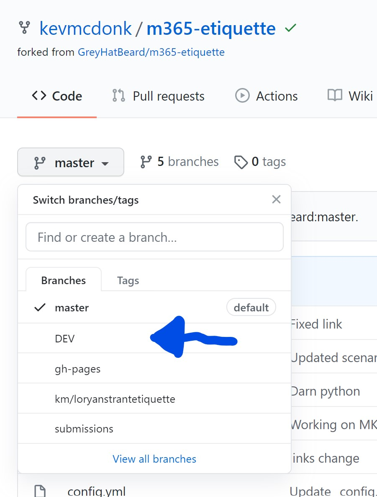

# The etiquette of Microsoft 365
Have you ever wanted a set of policies around how people should use Office 365/Microsoft 365? Do you find yourself repeating the same little bits of advice to people again and again and again? We're not talking about adoption specifically here, more about "Hey, you should always make sure you reply to a conversation in Teams rather than starting a new one" or "Keep files just for you in OneDrive and move them to the appropriate team's SharePoint when you want to work together". Wouldn't it be great if there was a place to get all these useful suggestions in one place?

Welcome to the etiquette of Microsoft 365!

## Aim
The purpose of this site is to be able to collect and share all those useful suggestions for the right way to use Microsoft 365 services and put them in a way that you can choose the ones for your organisation and share.

At the moment, these are all in Github and can be copied as markdown files from there but the attention is to be able to create downloadable packages so you can host your own site similar to this but also have it on SharePoint or in Teams so it is there front and centre.

What is even better is that we want this to be community driven so if you have your own tips, then feel free to add them. If you have a good idea on how to share them internally, raise an issue and then get started with building it. Sharing is Caring.

## Structure

The tips are broken down in to specific services or approaches although this may evolve over time, especially where some tips will overlap both.

#### By Service
- [Outlook](By-service/Outlook)
- [Teams](By-service/Teams)
- [OneNote](By-service/OneNote)
- [Planner](By-service/Planner)

#### By Approach
- [Asking questions](By-approach/Asking-questions)
- [Communicating](By-approach/communicating)
- [Files](By-approach/files)
- [Liking posts](By-approach/Linking-posts)
- [Voice](By-approach/voice)
- [Working out loud](By-approach/Working-out-loud)

## Contributing
There are three options for contributing:

- Using GitHub
- Fill out a form
- Send a tweet with #M365Etiquette

Our preferred way is in GitHub but we know that isn't for everyone so scroll further down for simpler options.

- To contribute, first ensure that you have created an account at [GitHub](https://github.com).
- Once set up, navigate to the [GreyHatBeard repo](https://github.com/GreyHatBeard/m365-etiquette) and click on Fork to take a clone of the repo to your own profile

- Change the branch to Dev

- Make changes/additions in the Docs folder

- Once you have completed your changes, create a new pull request from the Pull Request menu at the top and with the details similar to below

- Give us a little time to review and get back to you - if we are a bit slow, send us a nudge on Twitter [@GreyHatBeard](https://twitter.com/greyhatbeard)
- Bask in the glory of community sharing!

If that is too much, then you can use the form below which will log an issue to GitHub that we can use to add an item.
[Form submissions](https://forms.office.com/Pages/ResponsePage.aspx?id=0tMYtjHB_UKmKTcR2Erydauh6Eg6DZtPsgDp6dFDeitUNDFaM0NIV0taVFhVNVJQTzNMWjFSRzlVUC4u)

Finally, send a tweet with [#M365Etiquette](https://twitter.com/hashtag/m365Etiquette) and we log those as issues in GitHub too! These are the hardest for us so we'd love you to use the others to get things there quickly but we also want to get your great content in here.

